# RARELY — LESS COMPARISON. MORE YOU. 

> A calm, creative mobile space for mood-based moments, journaling, self-expression, routines, and positive community.

[](https://reactnative.dev/)
[](https://expo.dev/)
[](https://www.typescriptlang.org/)
[](https://trpc.io/)
[](https://orm.drizzle.team/)

RARELY is designed around a simple product principle: **the user is the main character**. The product should help someone notice what they feel, make something small, save moments worth keeping, and return to a positive community without turning self-expression into a performance.

---

## Table of contents

1. [Product overview](#1-product-overview)
2. [Design philosophy](#2-design-philosophy)
3. [System architecture](#3-system-architecture)
4. [Repository structure](#4-repository-structure)
5. [Runtime and navigation](#5-runtime-and-navigation)
6. [Home and Rare Moment](#6-home-and-rare-moment)
7. [Create and creative tools](#7-create-and-creative-tools)
8. [Community](#8-community)
9. [Rare Studio](#9-rare-studio)
10. [Profile and Scrapbook](#10-profile-and-scrapbook)
11. [Journaling and private persistence](#11-journaling-and-private-persistence)
12. [Personalization engine](#12-personalization-engine)
13. [AI architecture and safety](#13-ai-architecture-and-safety)
14. [Networking, tRPC, authentication, and server](#14-networking-trpc-authentication-and-server)
15. [Data layer and database](#15-data-layer-and-database)
16. [Monetization model](#16-monetization-model)
17. [Reliability, degraded states, and failure handling](#17-reliability-degraded-states-and-failure-handling)
18. [Accessibility and interaction quality](#18-accessibility-and-interaction-quality)
19. [Development setup](#19-development-setup)
20. [Commands and validation](#20-commands-and-validation)
21. [Testing strategy](#21-testing-strategy)
22. [Security and privacy](#22-security-and-privacy)
23. [Build and deployment](#23-build-and-deployment)
24. [Operational runbook](#24-operational-runbook)
25. [Roadmap and extension points](#25-roadmap-and-extension-points)
26. [Contributing](#26-contributing)
27. [License and credits](#27-license-and-credits)
28. [Appendix: technical reference](#28-appendix-technical-reference)

---

# 1. Product overview

## What is RARELY?

RARELY is a creative self-expression product organized around **mood, moments, making, memory, and community**. The primary interaction is deliberately small: a user arrives, identifies how they feel, and gets a focused activity that can be completed in roughly ten minutes. From there the experience opens into journal entries, photo prompts, music moods, collages, creative AI, community circles, rituals, and a private scrapbook.

The repository describes the product direction as a calm, premium creative space with portrait-first, one-handed interactions. The visual language is warm and editorial rather than clinical or productivity-oriented.

The current navigation model is:

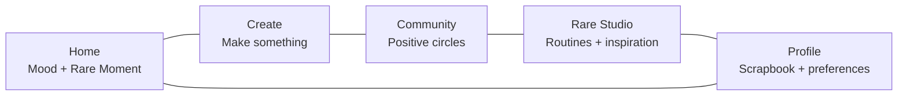

## Core product loop

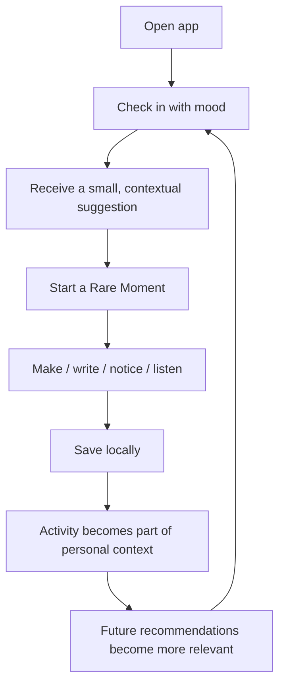

The loop is intentionally gentle. Personalization should feel like memory and continuity, not surveillance. This is why the current implementation derives recommendations from saved preference signals, counts, timestamps, and explicit feedback instead of feeding private journal text into recommendation logic.

## Current product capabilities

The repository currently contains substantial client-side UX work across:

* mood-aware Home recommendations;
* a focused Rare Moment detail flow;
* local journals, drafts, edits, delete/recovery behaviors, and export;
* creative tools such as photo prompts, music moods, collages, and Rare AI;
* community circle previews with local participation state;
* Rare Studio routines with completion and reversal flows;
* profile activity summaries and scrapbook history;
* local personalization with explicit recommendation feedback;
* privacy-aware AI prompt policies, fallbacks, and prompt history;
* membership / monetization state and usage-prompt scaffolding;
* cross-platform Expo configuration for native and web runtimes.

---

# 2. Design philosophy

## 2.1 The user is the main character

The application avoids building the product around a celebrity feed or a content-creator persona. The design plan explicitly frames Selena Gomez as a creative host rather than the subject of a fan feed. In implementation terms, this means the reusable primitives revolve around the user's mood, creations, activity history, and saved preferences.

## 2.2 Calm information architecture

The design plan specifies portrait orientation, one-handed use, generous touch targets, and a deliberately quiet information hierarchy. Primary actions sit in the lower half of the screen, while cards provide enough structure to make secondary information discoverable without creating dashboard density.

The core visual token set is:

| Token      | Value     | Intended role                       |
| ---------- | --------- | ----------------------------------- |
| Background | `#FBF8F3` | Warm application canvas             |
| Surface    | `#FFFFFF` | Elevated cards and reading surfaces |
| Foreground | `#2B1D2F` | Main text / headings                |
| Muted      | `#7E6F7D` | Metadata / secondary copy           |
| Primary    | `#E96F61` | CTA / active state                  |
| Secondary  | `#F5D7CF` | Mood emphasis                       |
| Lavender   | `#D9CDE7` | Creative / reflective content       |
| Sage       | `#D8E1D5` | Community / impact content          |
| Border     | `#EDE4E0` | Dividers and card outlines          |

## 2.3 Native-feeling interaction

The app uses React Native primitives plus Expo modules for haptics, media, notifications, sharing, safe areas, and deep linking. Primary interactions provide press feedback, selected-state semantics, and haptic confirmation where supported.

The result is closer to a first-party mobile utility than a web page placed inside a phone frame.

---

# 3. System architecture

## 3.1 Architectural shape

RARELY is a hybrid mobile/web application:

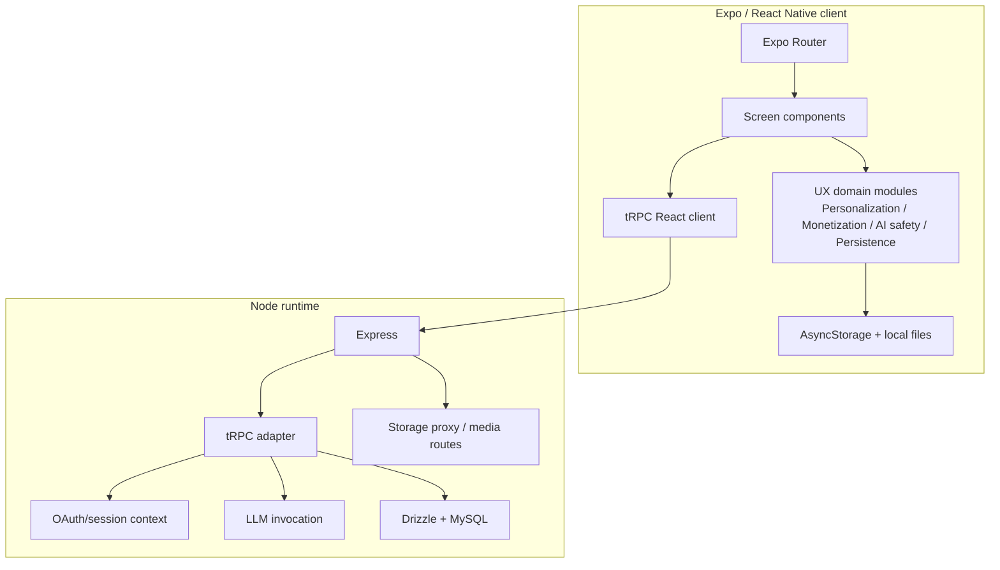

## 3.2 Architectural principles

### Local-first user state

A large amount of product state is intentionally local: last mood, preferences, recommendation feedback, journal drafts, saved journal records, activity history, AI prompt history, favorites, and monetization UX state.

### Typed application boundary

The client and server share the `AppRouter` type from `server/routers.ts`, and the client uses `@trpc/react-query` with `superjson`. The transformer is intentionally configured inside the `httpBatchLink`.

### Graceful degradation

Many flows are designed to remain useful when storage, local capabilities, or AI services fail. The Home screen, for example, can fall back to curated local starter content and displays a transparent degraded-state message rather than silently pretending everything is personalized.

---

# 4. Repository structure

The top-level tree is intentionally separated by responsibility.

```text
rarely-mobile/
├── app/                    # Expo Router routes and screen composition
│   ├── (tabs)/             # Home / Create / Community / Studio / Profile
│   ├── dev/                # Development-only routes
│   ├── oauth/              # OAuth callback route
│   ├── _layout.tsx         # Root providers + navigation boundary
│   ├── moment.tsx          # Rare Moment detail flow
│   ├── journal.tsx         # Journal composer
│   ├── circle.tsx          # Community circle detail
│   ├── routine.tsx         # Studio routine detail
│   ├── scrapbook.tsx       # Private activity timeline
│   └── preferences.tsx     # Preference management
│
├── components/             # Reusable presentation components
│   ├── ui/                 # Shared UI primitives
│   ├── app-error-boundary.tsx
│   ├── haptic-tab.tsx
│   ├── screen-container.tsx
│   └── ...
│
├── constants/              # Environment-driven and platform constants
├── hooks/                  # Reusable React hooks
├── lib/                    # Client libraries + UX domain logic
│   ├── _core/              # Runtime/auth helpers
│   ├── ux/                 # Product behavior modules
│   ├── trpc.ts             # Typed API client
│   └── ...
│
├── drizzle/                # SQL schema + migrations metadata
├── server/                 # Express + tRPC server
│   ├── _core/
│   ├── db.ts
│   ├── routers.ts
│   └── storage.ts
│
├── shared/                 # Cross-layer types/constants
├── scripts/                # Build/asset/env utilities
├── tests/                  # Deterministic unit/integration coverage
├── assets/images/          # App artwork and generated media
├── design.md               # Product UI direction
├── todo.md                 # Implementation history / backlog
├── app.config.ts           # Expo app configuration
├── package.json            # Scripts and dependencies
└── pnpm-lock.yaml          # Locked dependency graph
```

## Why the split matters

The `app/` tree is optimized around user journeys. The `lib/ux/` tree is optimized around behaviors that can be reused by those journeys. That distinction is valuable because personalization, privacy, recovery, and monetization rules otherwise tend to be duplicated across screens.

The repository has already moved several of these concerns into shared helpers: async guards, personalization ranking, local activity parsing, journal persistence, AI prompt policy, and monetization state normalization.

---

# 5. Runtime and navigation

## 5.1 Root provider tree

`app/_layout.tsx` is the main runtime boundary. It wires together:

* React Query;
* tRPC;
* Expo Router stack navigation;
* safe-area handling;
* theme provider;
* gesture handler root;
* error boundary;
* Manus runtime initialization;
* session persistence;
* onboarding routing;
* non-fatal error reporting.

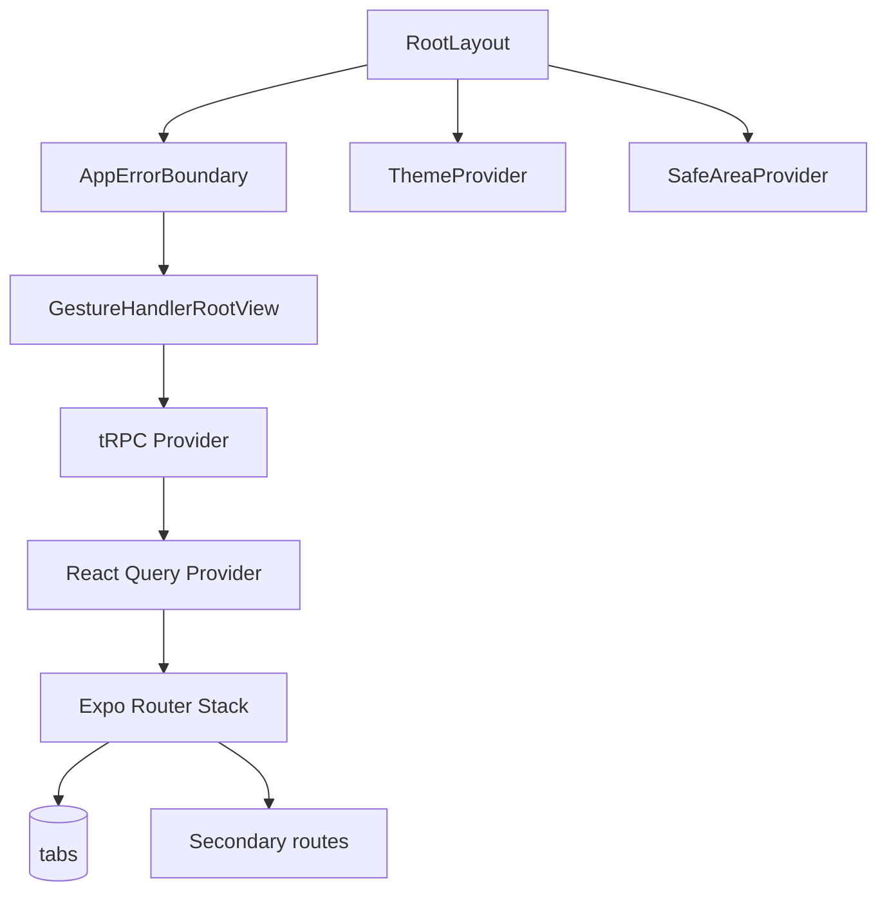

## 5.2 Five-tab shell

The bottom tab bar defines five core surfaces:

| Tab       | Route               | Purpose                      |
| --------- | ------------------- | ---------------------------- |
| Home      | `/(tabs)`           | Mood check-in + Rare Moment  |
| Create    | `/(tabs)/create`    | Creative activities          |
| Community | `/(tabs)/community` | Positive circles             |
| Studio    | `/(tabs)/studio`    | Routines and inspiration     |
| Profile   | `/(tabs)/profile`   | History, settings, scrapbook |

The tab layout uses haptic tab buttons, semantic labels, safe-area-aware bottom padding, active/inactive theme colors, and keyboard-aware hiding.

## 5.3 Deep links and OAuth

`constants/oauth.ts` constructs platform-specific redirect URIs: web uses the API callback endpoint, while native platforms use an Expo deep-link scheme. Environment-driven values include the OAuth portal URL, OAuth server URL, app ID, owner metadata, and API base URL.

The Expo config declares an Android intent filter and the RARELY app scheme, alongside the portrait orientation and native capabilities.

---

# 6. Home and Rare Moment

Home is the product's behavioral center.

## 6.1 Mood selection

The current Home implementation exposes six mood options:

```text
Happy       ☀️
Stressed    🌧️
Creative    ✨
Tired       🌙
Excited     ⚡
Just vibing 🪩
```

Each mood maps to a curated Rare Moment with a title, short description, three steps, and a visual treatment. Example mappings include:

* **Creative** → “Make a little magic”
* **Tired** → “Gentle is enough”
* **Stressed** → “A softer place to land”
* **Excited** → “Channel the spark”

The selected mood is persisted to AsyncStorage as `rarely.lastMood`, and selection writes an entry to personalization history.

## 6.2 Personalized ranking

Home does not simply select a random card. It constructs a `PersonalizationProfile` from:

* onboarding preferences;
* journal count;
* saved Rare Moments;
* joined community circles;
* completed routines;
* recent activity timestamp;
* explicit recommendation feedback.

The profile is then used to derive a top interest label and a preferred set of Create tools.

## 6.3 Recommendation feedback

Every recommendation domain supports a reversible feedback signal:

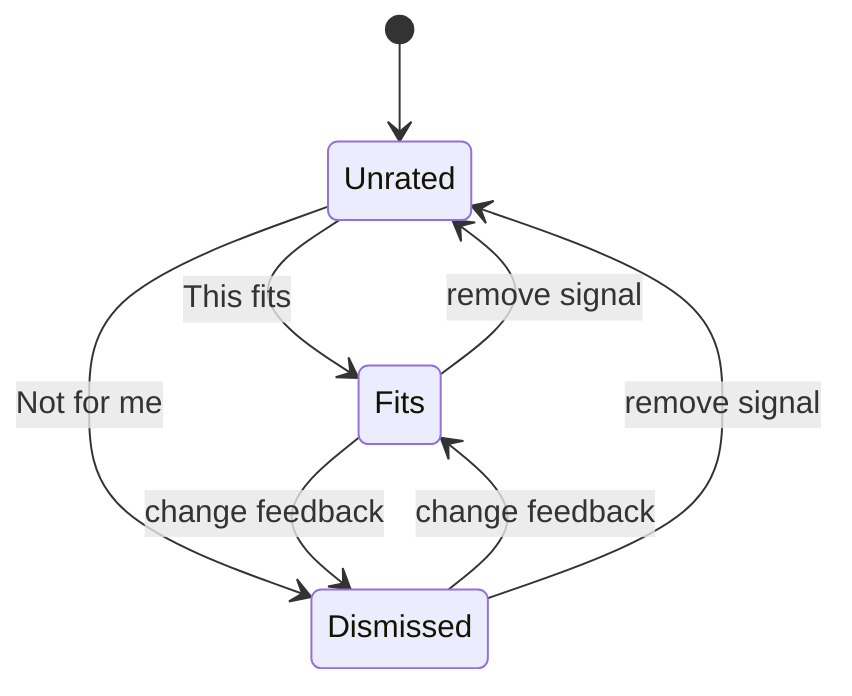

The scoring function gives positive feedback a smaller magnitude than negative feedback, then applies recency and staleness adjustments. The implementation also introduces exploration when confidence is low: if the current leader has little evidence, an unseen candidate can be promoted into the second position.

Conceptually:

```text
score(item)
  = (2 × fits - 3 × dismissed) × staleness_weight
  + recent_positive_boost
  + recent_negative_penalty
```

This is intentionally simple. It is explainable, local, deterministic, and easy to test.

## 6.4 Rare Moment detail

The detail flow receives the chosen mood as a route parameter, normalizes it, shows a mood-specific visual sequence, and allows the user to complete or return. The source includes different three-image sequences for Happy, Stressed, Creative, Tired, Excited, and Vibing moments.

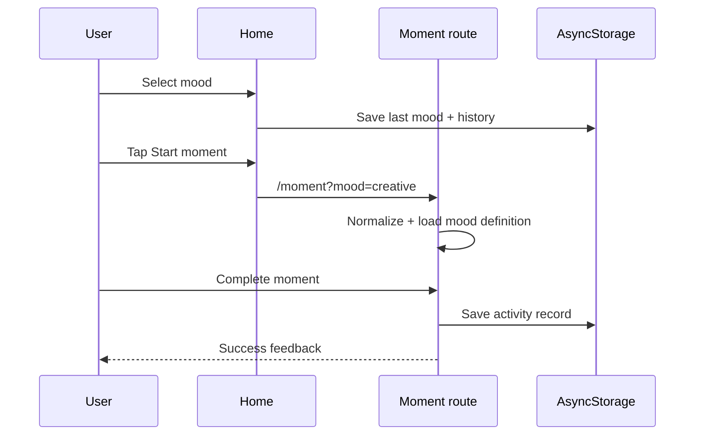

---

# 7. Create and creative tools

The Create tab acts as the app's maker hub.

## 7.1 Current tool set

| Tool           | Intent                                     |
| -------------- | ------------------------------------------ |
| Journal        | Private writing                            |
| Photo prompt   | Notice an ordinary detail                  |
| Music mood     | Build a small soundtrack                   |
| Collage        | Collect colors and textures                |
| Rare AI        | Get a creative idea                        |
| Sponsor Studio | Transparent provider-oriented styling demo |

The route personalizes ordering using shared ranking helpers and a local preference profile. It also includes explicit AI-safety checks before sending user-controlled creative prompts.

## 7.2 Tool personalization

The preference model weights tools according to interests:

```text
Journal  = journaling + 0.35 × creativity
Photo    = creativity + 0.20 × beauty
Music    = music
Collage  = creativity + 0.25 × beauty
AI       = creativity + 0.15 × journaling
```

This is not intended to be a machine-learning model. It is a transparent ranking layer that can be inspected, unit tested, and reset.

## 7.3 Creative journeys

Some Create tools open a structured journey rather than an empty composer. For example, the Photo prompt route preloads a writing starter that asks what was noticed, why it stood out, and what feeling the image carries. The Music Mood journey provides a three-song scaffold plus a body/feeling reflection.

This is a key design pattern: **the product should lower the activation energy of creativity**.

---

# 8. Community

Community is intentionally modeled as a set of positive, moderated topic circles rather than an infinite social feed.

## 8.1 Current circles

The current Community route seeds three circles:

* **Make Room for Ideas** — creative curiosity
* **Soft Confidence** — confidence and self-recognition
* **The Listening Room** — music and emotional atmosphere

Each circle includes a positive prompt and topic metadata.

## 8.2 Recommendation ordering

Community uses the same personalization profile as Home and Studio. The ranking helper selects a preferred base order based on the user's top interest, then overlays explicit feedback.

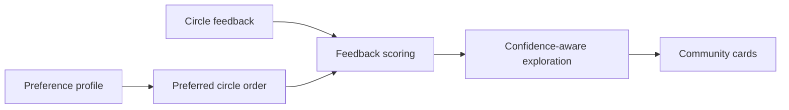

## 8.3 Reversible participation

Circle joins are local activity records, and the repository's implementation history records completed work for reversible joins, synchronized counts, timestamps, and undo recovery. This lets the product treat community participation as a user-controlled state rather than a one-way commitment.

## 8.4 Extension / next step

A production community backend would need server-managed membership, moderation, reporting, rate limiting, abuse detection, identity controls, and privacy-preserving analytics. The current implementation should be read as a product-ready interaction model rather than proof that those services already exist.

---

# 9. Rare Studio

Rare Studio is the app's ritual and routine surface.

## 9.1 Current routine model

The Studio route currently seeds:

| Routine    | Theme                         | Duration / tag |
| ---------- | ----------------------------- | -------------- |
| Soft focus | Lower-intensity creative care | `5 MIN`        |
| Color play | Single-color creative ritual  | `CREATIVE`     |
| The reset  | Wind-down / evening ritual    | `EVENING`      |

These are local content records today.

## 9.2 Recommendation model

Studio uses the same profile, feedback, and exploration machinery as Community.

The base preference mapping favors:

```text
beauty      → soft → reset → color
creativity  → color → soft → reset
other       → soft → color → reset
```

Then recommendation feedback can change the ranking while preserving exploration when evidence is weak.

## 9.3 Completion state

Routine completion is recorded locally with timestamps and can be reversed. Those records feed the Profile and Scrapbook surfaces, which gives users a sense of continuity: a ritual is not merely something they tapped; it becomes part of the private activity history.

---

# 10. Profile and Scrapbook

Profile is the reflective surface of the product.

## 10.1 Activity highlights

The Profile route exposes four primary counters:

* thoughts kept;
* Rare Moments;
* circles joined;
* rituals completed.

The source code computes these from local activity records instead of fixed placeholder values. It also sorts activity by timestamps and surfaces the most recent items.

## 10.2 Scrapbook model

The scrapbook is a chronological local timeline combining multiple activity kinds:

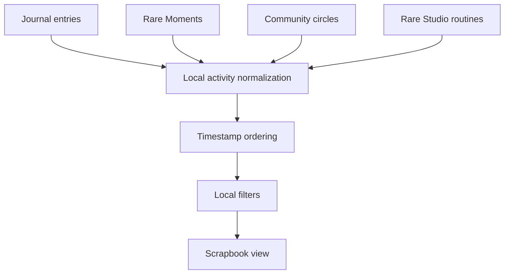

The implementation history records scrapbook refinements including activity filters, edit/delete actions, undo recovery, privacy toggles, image viewing, full-note access controls, and synchronization with Profile.

## 10.3 Private notes and privacy preview

Activity detail surfaces can contain private notes. The repository explicitly distinguishes concise preview text from full-note access and includes a user-controlled setting for showing or hiding private activity-note previews.

That distinction matters: **privacy is treated as a UI behavior, not merely a database setting**.

## 10.4 Journal export

Profile can export local journal content through a native share flow. The implementation provides a formatting utility plus capability checks rather than assuming every platform supports the same native features.

---

# 11. Journaling and private persistence

Journaling is one of the strongest examples of the product's local-first philosophy.

## 11.1 Journal composer

The Journal route supports:

* daily prompt selection;
* text composition;
* optional local image attachment;
* draft save/recovery;
* edit existing entries;
* delete with recovery support;
* AI-assisted prompt refinement;
* explicit privacy disclosure;
* native sharing/export from Profile.

The composer reads route parameters for editing and recovered drafts, and it keeps draft state separate from saved entries.

## 11.2 Draft state machine

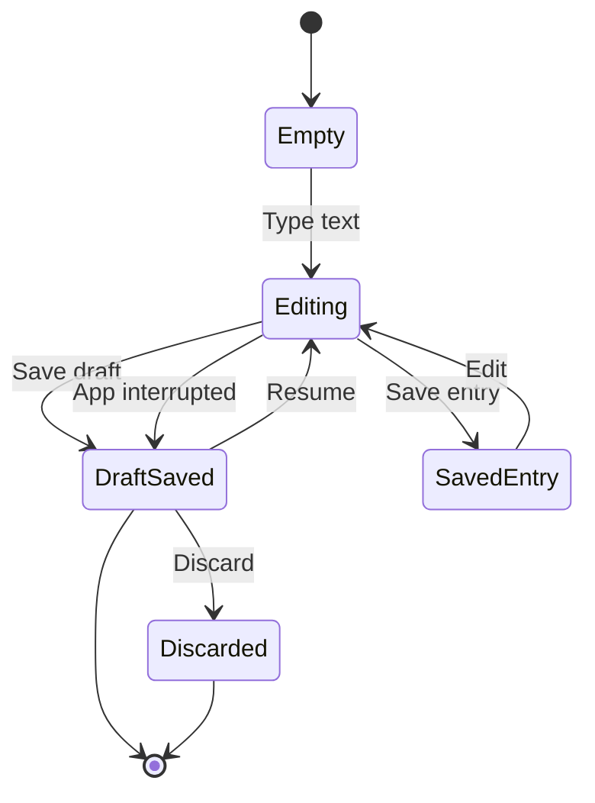

## 11.3 Persistence contract

`journalPersistence.ts` defines a deliberately defensive contract:

```ts
type JournalDraftRecord = {
  text: string;
  updatedAt?: string;
  prompt?: string;
  imageUri?: string;
};
```

Loading can return:

```text
empty
loaded
malformed
unavailable
```

Private image references are accepted only when they match local-style URI schemes such as `file:`, `content:`, `ph:`, `blob:`, or `data:image`. File URIs can also be checked for existence when a file-system reader is available.

This is a strong reliability pattern: parsing failure does not automatically mean user content is lost.

## 11.4 Privacy boundary

The AI prompt policy explicitly states that private journal text and images should not be used as AI context. The UI disclosure distinguishes the governed AI path from a private fallback path where nothing is sent anywhere.

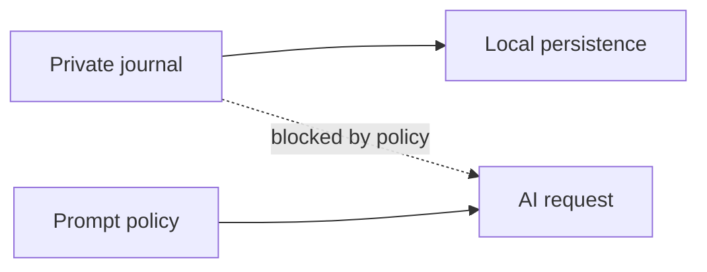

---

# 12. Personalization engine

Personalization is local, explicit, and explainable.

## 12.1 Profile construction

The profile contains:

```ts
export type PersonalizationProfile = {
  topInterestKey: ...;
  topInterestLabel: string;
  totalMemories: number;
  recentActivity: boolean;
  preferredCreateTools: string[];
  quietHours: boolean;
};
```

The source computes `totalMemories` as the sum of journals, moments, circles, and routines, and marks activity as recent when the latest known activity is within seven days.

## 12.2 Explanation model

Recommendations have short rationales such as “A creative moment shaped around your creativity…”. The rationale changes when recent activity exists but does not expose the underlying private records.

This creates a useful product property:

> The system can explain **why a class of recommendation appeared** without exposing the private material that influenced the user's local state.

## 12.3 Feedback and confidence

Confidence is derived differently for mood, create, circle, and routine scopes. That matters because one “fits” signal should not mean the same thing for every recommendation type.

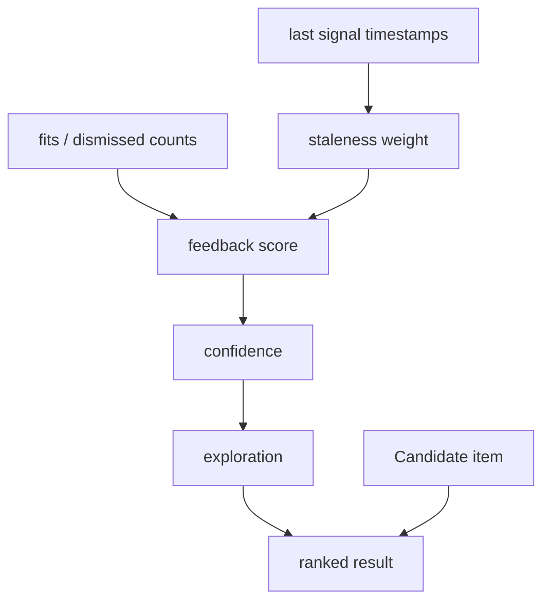

## 12.4 Quiet hours

The profile can include `quietHours`, and time-aware prompts adapt their language around morning, afternoon, and evening. Quiet-hours mode suppresses more energetic framing and substitutes gentler, optional prompts.

## 12.5 Reset principle

Personalization should remain user-controlled. The repository includes reset-personalization behavior, local history, and privacy-aware settings.

---

# 13. AI architecture and safety

RARELY uses AI as a **creative aid**, not as a therapist, diagnostic system, or oracle.

## 13.1 Server-side AI boundary

The server router exposes creative procedures including:

* `creative.generate`
* `creative.generateVisual`
* `creative.synthesize`

The implementation validates inputs using Zod, sends tightly constrained prompts to an LLM service, and validates the output before returning it.

The structured generation path expects:

```text
title: string ≤ 70 chars
summary: string ≤ 220 chars
lines: exactly 3 strings ≤ 100 chars each
palette: exactly 3 six-digit hex colors
```

If structured generation fails validation or throws, the server returns a deterministic fallback instead of propagating malformed model output.

## 13.2 AI request safety

The client-side safety layer:

1. requires explicit consent;
2. limits serialized AI context to 4,000 characters;
3. detects secret-like strings such as emails, phone numbers, passwords, tokens, or API keys;
4. can minimize objects to an allowlisted key set;
5. caps AI output length at 12,000 characters.

The source is intentionally simple and auditable.

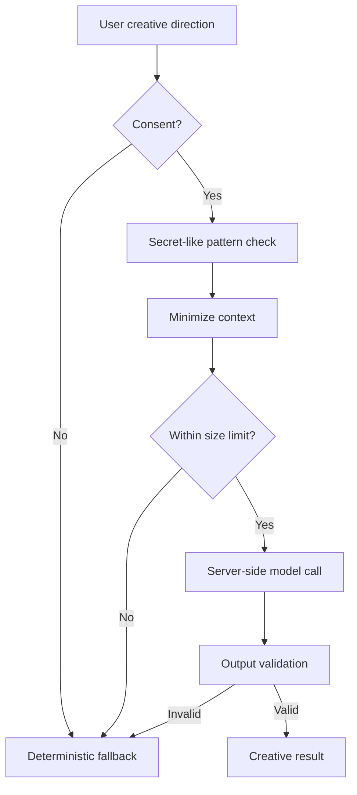

## 13.3 Prompt governance

`aiPrompts.ts` defines an explicit prompt governance version and a privacy boundary stating that private journal text and images are not used. It also defines fallback prompts for Spark, Reflect, and Play modes.

## 13.4 AI modes

| Mode    | Intended output                        |
| ------- | -------------------------------------- |
| Spark   | One surprising, kind creative question |
| Reflect | One grounded reflection question       |
| Play    | One light imaginative question         |

The modes are intentionally narrow because predictable behavior is easier to explain, test, and govern than a generic “ask anything” assistant.

## 13.5 Creative image generation

`generateVisual` accepts a limited mode set: vision, manifestation, and moodboard. The server maps those modes to constrained image prompts that request text-free editorial imagery and explicitly disallow faces, logos, medical imagery, promises, and personal data.

---

# 14. Networking, tRPC, authentication, and server

## 14.1 Client networking

The client builds a tRPC client with `httpBatchLink` and `superjson`. It obtains a session token asynchronously and sends it as a Bearer token when available. Requests also include credentials for cookie-based auth.

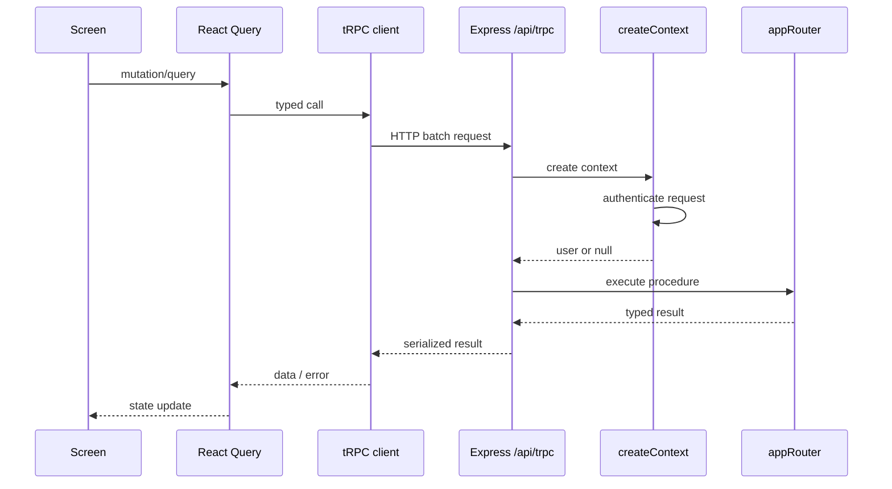

## 14.2 Authentication context

The server's `createContext` attempts to authenticate every request, but explicitly allows unauthenticated execution for public procedures. The resulting context carries `req`, `res`, and an optional `user`.

The current router exposes `auth.me` and `auth.logout`; additional protected product routers can be layered onto this foundation.

## 14.3 Server process

The Express server currently:

* uses `dotenv/config`;
* reflects safe HTTP(S) origins for CORS;
* enables credentials;
* accepts JSON and URL-encoded payloads up to 50 MB;
* registers storage and OAuth routes;
* exposes `/api/health`;
* mounts tRPC at `/api/trpc`;
* searches for an available port beginning at the configured port.

## 14.4 Environment loading

The project includes a custom environment loader that prefers already-defined system variables over `.env` values. It also maps selected `VITE_*` / server variables into Expo public equivalents so the same project can operate inside the development/runtime environment.

---

# 15. Data layer and database

## 15.1 Drizzle schema

The current Drizzle schema contains a foundational `users` table with:

```text
id
openId
name
email
loginMethod
role
createdAt
updatedAt
lastSignedIn
```

The table uses MySQL types and keeps `openId` unique. The schema file itself notes that additional product tables should be added as the product grows.

## 15.2 Shared type exports

`shared/types.ts` re-exports the database model types alongside shared error definitions. This gives screens and server modules a single import boundary for shared types.

## 15.3 Current split between local and server data

A useful way to understand the current state is:

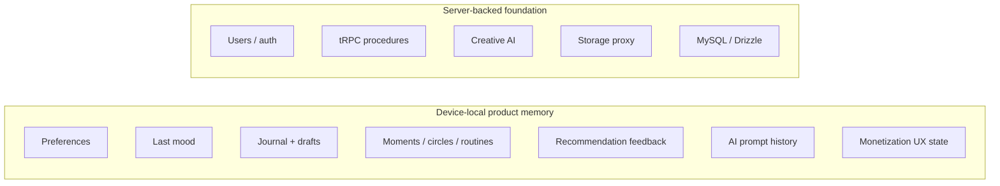

The most important design consequence is that **the current database is not the canonical store for every product object**. Much of the user experience remains local-first.

## 15.4 Extension / next step: canonical domain schema

As RARELY becomes multi-device or social, the database will likely need explicit tables for entities such as:

```text
users
profiles
preferences
journal_entries
journal_attachments
rare_moments
activity_records
community_circles
circle_memberships
routines
routine_completions
recommendation_feedback
ai_prompt_events
ai_prompt_favorites
subscriptions
entitlements
moderation_events
```

This should be introduced deliberately. Moving every local record into a server database too early would undermine the current privacy and offline-first behavior.

---

# 16. Monetization model

The repository includes a substantial local monetization module and membership surfaces.

## 16.1 Product philosophy

Monetization is implemented as a state machine around:

* current membership state;
* trial / plan activation;
* usage-triggered upgrade prompts;
* prompt impression caps;
* experiment assignments;
* analytics counters;
* normalized timestamps;
* idempotent repeated activation actions.

## 16.2 Non-coercive upgrade flow

On Home, an upgrade card appears only when local usage behavior satisfies configured rules and the user is not already premium. The code also records that the prompt was shown and handles analytics failure as non-blocking.

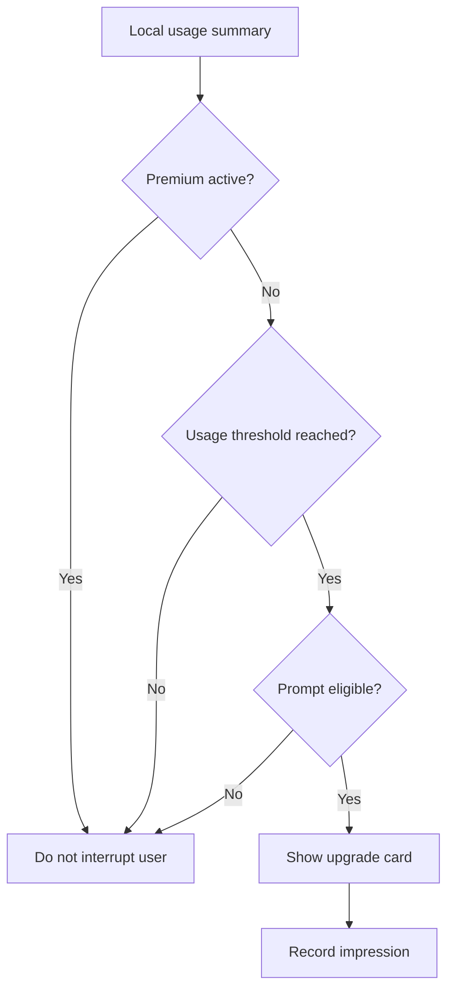

The README should not be interpreted as claiming that native App Store / Play billing is implemented. The repository currently contains product-side membership state and monetization UX scaffolding; payment-provider integration is a separate deployment concern.

---

# 17. Reliability, degraded states, and failure handling

Reliability is a major theme in the repository.

## 17.1 Non-fatal errors

Instead of allowing optional persistence or haptic capabilities to break the experience, screens commonly use helpers such as `withNonFatal` and `reportNonFatalError`.

For example, Home can continue to show a local starter even when local activity refresh fails. Journal draft cleanup is explicitly best-effort, and the UI can preserve a draft if cleanup cannot be completed.

## 17.2 Degraded-state ladder

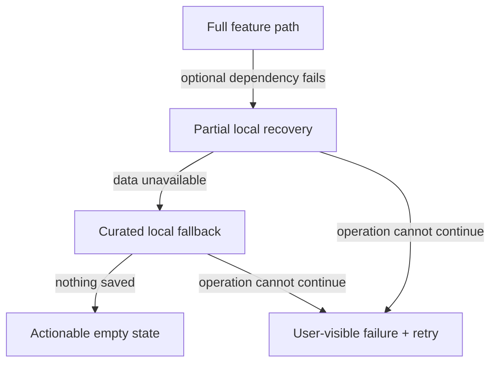

This ladder is more useful than a single “error screen” because many RARELY features can still provide value when a dependency is missing.

## 17.3 Route guard strategy

The repository includes shared route-parameter normalization and guard utilities so deep links cannot easily create invalid activity IDs or unsupported modes.

## 17.4 Data loss avoidance

Journal behavior illustrates an important rule: **save first, cleanup second**. The persistence layer makes draft clearing best-effort, which is safer than treating cleanup as part of the critical transaction.

---

# 18. Accessibility and interaction quality

Accessibility is built into product behavior rather than bolted on afterward.

## 18.1 Semantics

Home mood buttons provide:

* `accessibilityRole="button"`;
* accessible labels;
* selected-state semantics.

The tab bar exposes accessibility labels for Home, Create, Community, Studio, and Profile. The implementation history also records accessibility work across journal, scrapbook, activity details, image viewers, and privacy toggles.

## 18.2 Reduced motion

Home listens to `AccessibilityInfo.isReduceMotionEnabled()` and changes its animation duration / behavior when reduced motion is active. This pattern is especially important for the mood-transition animation because the interaction is repeated frequently.

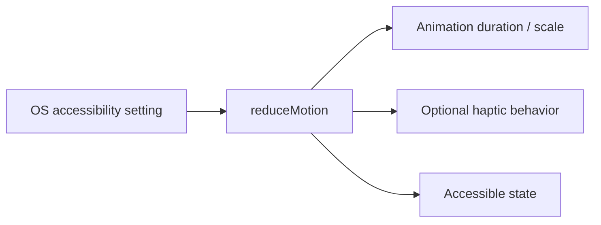

## 18.3 Honest feedback

The app uses local snackbars for confirmation and failure messaging. These messages are important because local-first persistence can fail without a network error, and the user needs to know whether an action actually completed.

## 18.4 Visual fallback

The project deliberately preserves text-first context around visual assets so that image-heavy flows do not become inaccessible or meaningless when images fail to load.

---

# 19. Development setup

## Requirements

Use the versions declared by the repository toolchain. The current `package.json` specifies:

* pnpm `9.12.0`;
* Expo `~54.0.37`;
* React `19.1.0`;
* React Native `0.81.5`;
* TypeScript `~5.9.3`;
* Node type definitions for Node 22.

The application is configured for portrait orientation, Expo Router, Metro web output, and a new-architecture React Native runtime.

## Install

```bash
git clone https://github.com/lucylow/rarely-mobile.git
cd rarely-mobile
pnpm install
```

## Environment

Create a local `.env` file as needed for the environment in which the project is being run. The runtime reads `.env` values without overriding variables that are already present in the process environment. The project also maps several runtime variables into `EXPO_PUBLIC_*` variables.

Typical development configuration should provide the API/OAuth values expected by `constants/oauth.ts`.

> Do not commit production credentials or secrets to `.env` files. The repository's AI safety layer is not a substitute for secret management.

## Start development

The primary `dev` script runs the server and Expo Metro concurrently:

```bash
pnpm dev
```

Equivalent split processes:

```bash
pnpm dev:server
pnpm dev:metro
```

The Metro script starts web mode on port `8081` by default, while the server begins at port `3000` and searches for the next available port if necessary.

---

# 20. Commands and validation

The `package.json` defines a compact set of repeatable workflows.

| Command           | Purpose                           |
| ----------------- | --------------------------------- |
| `pnpm dev`        | Server + Metro development        |
| `pnpm dev:server` | Watch backend                     |
| `pnpm dev:metro`  | Start Expo Metro web runtime      |
| `pnpm android`    | Launch Android target             |
| `pnpm ios`        | Launch iOS target                 |
| `pnpm build`      | Bundle server with esbuild        |
| `pnpm start`      | Run production server bundle      |
| `pnpm check`      | TypeScript no-emit check          |
| `pnpm lint`       | Expo ESLint                       |
| `pnpm format`     | Prettier formatting               |
| `pnpm test`       | Vitest suite                      |
| `pnpm validate`   | Assets + typecheck + lint + tests |
| `pnpm db:push`    | Generate/migrate Drizzle state    |
| `pnpm qr`         | Generate project QR artifact      |

## Recommended contributor loop

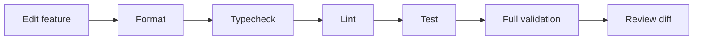

For changes touching persistence, personalization, AI, or monetization, the full `pnpm validate` path should be the default local gate.

---

# 21. Testing strategy

RARELY's strongest test candidates are deterministic behavior modules, not visual snapshots alone.

## 21.1 What should be unit tested

High-value deterministic modules include:

* recommendation scoring;
* feedback selection;
* confidence thresholds;
* exploration behavior;
* personalization profile construction;
* route parameter normalization;
* journal draft parsing;
* privacy-aware image URI handling;
* AI request checks;
* AI fallback behavior;
* monetization timestamp normalization;
* membership idempotency;
* prompt impression caps;
* export formatting.

## 21.2 Example test matrix

| Area          | Input                                    | Expected result                          |
| ------------- | ---------------------------------------- | ---------------------------------------- |
| Feedback      | 3 recent positive signals                | high confidence                          |
| Feedback      | 1 old positive signal                    | low/medium confidence depending on scope |
| Exploration   | low-confidence leader + unseen candidate | unseen candidate injected                |
| AI request    | no consent                               | reject                                   |
| AI request    | secret-like string                       | reject                                   |
| AI request    | oversized context                        | reject                                   |
| AI output     | >12k characters                          | reject                                   |
| Journal draft | malformed JSON                           | recoverable status                       |
| Journal image | remote URL                               | attachment skipped                       |
| Membership    | duplicate activation                     | idempotent result                        |

## 21.3 Testing philosophy

Avoid tests that encode implementation trivia. Prefer tests that encode product guarantees:

> “A private journal image is never accepted as AI context” is stronger than “function X returns false when regex Y matches.”

> “Deleting a journal can be recovered through undo” is stronger than “array splice happens once.”

This approach keeps tests useful when internal modules are refactored.

---

# 22. Security and privacy

Privacy is central to the product proposition.

## 22.1 Private data boundaries

The repository separates private local content from AI generation inputs. The governed AI prompt policy explicitly excludes private journal text and images, while the AI safety module attempts to reject obvious secret-like inputs.

## 22.2 Local data model

A significant amount of the product state remains on-device, which reduces the amount of personal creative material that needs server storage.

However, “local-first” does not automatically mean “secure.” Device backups, screenshots, shared devices, debugging logs, file-system permissions, and exported journals can all become privacy surfaces.

## 22.3 Server-side controls

A production deployment should add:

* strict authentication and authorization around protected procedures;
* CSRF protection where cookie-based auth is used;
* rate limiting on AI procedures;
* request-size and upload quotas;
* centralized secret management;
* audit logging for sensitive operations;
* secure storage policy for generated media;
* abuse and moderation controls for community features;
* data retention and account deletion workflows.

These are recommended production controls, not claims that every item already exists in the current repository.

## 22.4 AI privacy threat model

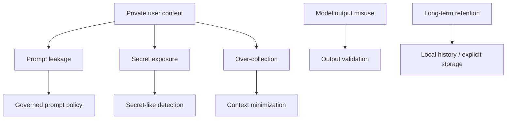

The existing code already implements the first four layers in some form; production hardening should make these controls server-verifiable and observable.

---

# 23. Build and deployment

## 23.1 Expo configuration

`app.config.ts` defines:

* app name: `RARELY — Be More You`;
* slug: `rarely-mobile`;
* portrait orientation;
* automatic user-interface style;
* iOS bundle identifier;
* Android package identifier;
* Android notification permission;
* deep-link intent filter;
* Metro static web output;
* Expo Router, font, audio, video, splash-screen, and build-properties plugins;
* typed routes and React Compiler experiments.

## 23.2 Native build configuration

Android is configured with a minimum SDK version of 24 and ARM architectures `armeabi-v7a` and `arm64-v8a`. iOS is configured to support tablets.

## 23.3 Server deployment

The backend can be bundled using esbuild:

```bash
pnpm build
pnpm start
```

The server itself runs from `dist/index.js` in production mode.

## 23.4 Deployment topology

A production topology could look like:

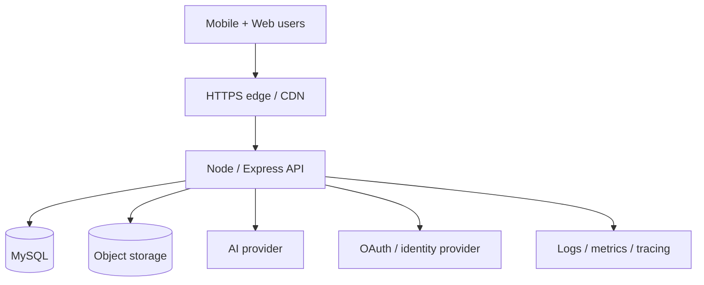

The current repository provides the application boundary for this topology; infrastructure provisioning is deployment-specific.

---

# 24. Operational runbook

## Symptom: Home shows local starter mode

Check:

1. whether local activity loading failed;
2. whether AsyncStorage is available;
3. whether a previous local activity snapshot contains malformed values;
4. whether retrying the screen clears the degraded condition.

The Home screen intentionally surfaces a local-preview message rather than silently pretending the recommendation context is complete.

## Symptom: AI suggestions are unavailable

Expected behavior is deterministic fallback. Verify:

```text
consent → request safety → server call → output validation → fallback
```

Do not bypass the safety modules to “make AI work.” The fallback is a product capability, not just an error case.

## Symptom: OAuth callback does not return to the app

Check:

* configured deep-link scheme;
* native intent filter;
* platform URL opening support;
* `EXPO_PUBLIC_OAUTH_*` values;
* API callback route;
* actual redirect URI generated by `getRedirectUri()`.

## Symptom: Journal draft cannot be recovered

Check the reported state:

```text
empty
loaded
malformed
unavailable
```

A malformed JSON wrapper can still be recovered as plain text, while invalid image references can be skipped instead of invalidating the whole draft.

## Symptom: Duplicate monetization action

Review the local monetization normalization and idempotency logic before adding another guard in a screen. The project has deliberately centralized repeated activation protection and analytics normalization.

---

# 25. Roadmap and extension points

The repository already contains a broad UX foundation. The next engineering challenge is to turn that foundation into a durable multi-user product without losing the local-first quality.

## 25.1 Canonical account model

Move from a minimal user table toward explicit product entities while keeping privacy-sensitive creative content optional and local.

## 25.2 Sync engine

A strong approach is **eventual sync of selected records**, not “upload everything.” For example:

```mermaid
flowchart LR
    L[Local activity]
    QUEUE[Outbox / sync queue]
    API[Sync API]
    DB[(Server domain DB)]
    MERGE[Conflict resolver]
    L2[Local canonical state]

    L --> QUEUE --> API --> DB
    DB --> MERGE --> L2
    L --> MERGE
```

The outbox should carry stable IDs, timestamps, operation types, and version metadata. Journal bodies and private images should only sync when the user explicitly opts into account backup / multi-device storage.

## 25.3 Community moderation

Production Community needs a backend moderation model with:

* reportable content;
* account-level rate limits;
* block/mute controls;
* moderator queues;
* audit events;
* configurable community policy.

## 25.4 Billing

Membership scaffolding can be connected to a billing provider while keeping the existing local state machine as the UI layer.

```text
Billing provider
   ↓ webhook
Server entitlement service
   ↓ normalized entitlement
tRPC / API
   ↓
Local monetization state
   ↓
Product gates + messaging
```

## 25.5 AI evolution

Future AI work should preserve the same contract:

```text
explicit consent
    ↓
minimal context
    ↓
policy version
    ↓
provider request
    ↓
validated structured result
    ↓
deterministic fallback
```

A broader model does not require broader data access.

## 25.6 Observability

The next reliability layer should add privacy-safe telemetry around:

* feature success/failure rates;
* fallback frequency;
* local storage failures;
* AI rejection/fallback rates;
* recommendation feedback distribution;
* crash-free sessions;
* startup latency;
* screen transition failures.

The key is to capture operational signals without sending private journal content or full creative payloads.

---

# 26. Contributing

## Code organization rules

Prefer placing:

* route composition in `app/`;
* reusable UI in `components/`;
* cross-screen product behavior in `lib/ux/`;
* API procedures in `server/routers.ts` or dedicated routers;
* DB schema in `drizzle/`;
* cross-layer types in `shared/`.

Avoid copying recommendation, privacy, or async-guard logic into multiple screens.

## Pull request checklist

```text
[ ] Feature has an explicit user-facing failure state.
[ ] Async persistence cannot silently lose content.
[ ] Route params are normalized.
[ ] Accessibility labels/states are present.
[ ] Reduced-motion behavior is safe where animation exists.
[ ] Private content is not accidentally added to AI context.
[ ] AI output is validated.
[ ] Local fallbacks remain useful.
[ ] Deterministic behavior has tests.
[ ] pnpm validate passes.
```

## Commit scope

Keep commits narrow enough that the product behavior can be reviewed independently from refactors. When touching a privacy boundary, include the corresponding test in the same change whenever practical.

---

# 27. License and credits

This repository is maintained under its repository-level licensing terms and attribution requirements. Check the repository for the authoritative license file before redistributing or packaging the project.

Project: [`lucylow/rarely-mobile`](https://github.com/lucylow/rarely-mobile)

Important implementation references:

* [`design.md`](./design.md) — product and visual direction
* [`todo.md`](./todo.md) — implementation history and outstanding work
* [`app.config.ts`](./app.config.ts) — Expo runtime configuration
* [`package.json`](./package.json) — commands and dependencies
* [`server/routers.ts`](./server/routers.ts) — tRPC procedures and AI boundary
* [`drizzle/schema.ts`](./drizzle/schema.ts) — database foundation
* [`lib/ux/personalization.ts`](./lib/ux/personalization.ts) — local recommendation logic
* [`lib/ux/aiSafety.ts`](./lib/ux/aiSafety.ts) — AI request/output safety checks
* [`lib/ux/aiPrompts.ts`](./lib/ux/aiPrompts.ts) — prompt governance
* [`lib/ux/journalPersistence.ts`](./lib/ux/journalPersistence.ts) — draft persistence contract

---

# 28. Appendix: technical reference

## A. Key client routes

| Route               | Responsibility            |
| ------------------- | ------------------------- |
| `/(tabs)`           | Home                      |
| `/(tabs)/create`    | Creative hub              |
| `/(tabs)/community` | Community circles         |
| `/(tabs)/studio`    | Routines                  |
| `/(tabs)/profile`   | Private profile / history |
| `/moment`           | Rare Moment detail        |
| `/journal`          | Journal composer          |
| `/circle`           | Circle detail             |
| `/routine`          | Routine detail            |
| `/scrapbook`        | Chronological activity    |
| `/preferences`      | Preferences               |
| `/membership`       | Membership UX             |
| `/ai-history`       | AI prompt history         |
| `/oauth/callback`   | OAuth callback            |

## B. Key UX modules

```text
lib/ux/
├── aiContracts.ts
├── aiPrompts.ts
├── aiSafety.ts
├── export.ts
├── guards.ts
├── haptics.ts
├── journalPersistence.ts
├── localActivity.ts
├── localReset.ts
├── localStorage.ts
├── monetization.ts
├── motion.ts
├── onboardingMachine.ts
├── onboardingPersonalization.ts
└── personalization.ts
```

## C. AI contract boundary

```mermaid
flowchart TD
    UI[Create / Journal UI]
    CONTRACT[AiRequest / AiResult contracts]
    SAFETY[checkAiRequest]
    MIN[minimizeAiContext]
    SERVER[tRPC creative router]
    VALIDATE[Zod result validation]
    FALLBACK[Fallback content]
    HISTORY[Private local history]

    UI --> CONTRACT --> SAFETY
    SAFETY --> MIN --> SERVER
    SERVER --> VALIDATE
    VALIDATE --> HISTORY
    VALIDATE --> FALLBACK
```

## D. Data ownership model

A useful mental model for future engineering is:

```text
               RARELY
                  │
       ┌──────────┴──────────┐
       │                     │
  USER-CONTROLLED        SYSTEM-CONTROLLED
       │                     │
  journal text          app configuration
  attachments           routing
  saved moments         AI policy
  private notes         recommendation algorithm
  prompt history        membership UX rules
  feedback              server procedures
       │                     │
       └──────────┬──────────┘
                  │
             explicit bridge
                  │
          minimal typed API
```

That boundary is the architectural identity of the project. The most important future work is not simply “add more backend”; it is to preserve the user's sense of ownership as the product becomes more connected.

## E. Current implementation summary

At repository inspection time, RARELY has:

```text
Mobile framework        Expo 54 + React Native 0.81
Navigation              Expo Router
UI                      React Native + NativeWind utilities
Data fetching            React Query + tRPC
Serialization           SuperJSON
Validation               Zod
Database                 Drizzle ORM + MySQL schema
Server                   Express + tRPC
Auth                     OAuth/session foundation
Local persistence        AsyncStorage + local file references
AI                       Server-side creative generation + fallbacks
Testing                  Vitest
Build                    esbuild + Expo tooling
Package manager          pnpm 9.12
```

---

## Final perspective

RARELY is technically interesting because its core complexity is not a massive backend. It is the opposite: **a carefully layered mobile experience that tries to keep as much useful state as possible close to the user** while still having a real API, typed server boundary, AI tooling, database foundation, membership logic, and a path to multi-user growth.

The strongest architectural pattern in the repository is the repeated pairing of:

```text
personalization + explanation
AI + fallback
persistence + recovery
visuals + accessible text
monetization + non-coercive gating
local state + explicit privacy boundaries
```

That combination provides a practical foundation for evolving RARELY from a polished prototype into a durable product without losing the calm, intimate character that defines the experience.
